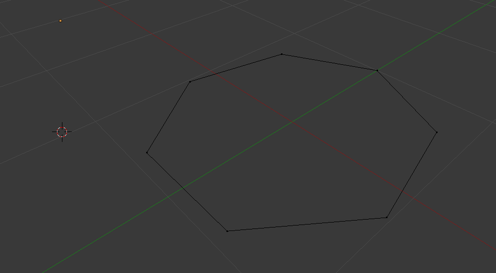
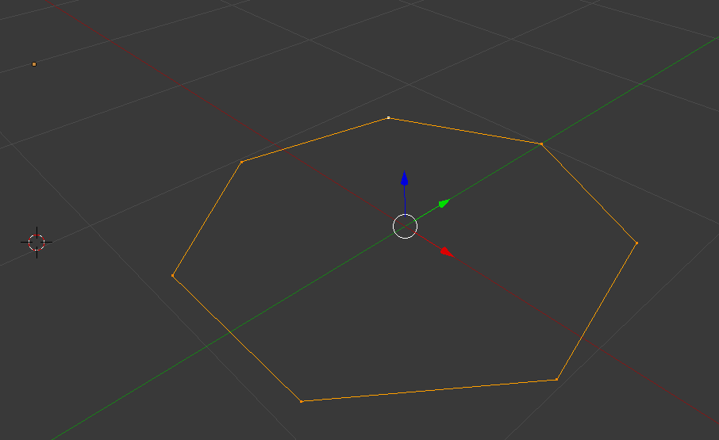
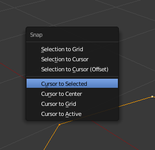
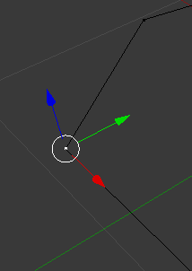

Stelle zuerst sicher, dass Du im Edit Mode bist.

Wir beginnen mit einem 7-Eck und stellen durch mehrmaliges Drücken der Taste A sicher, dass kein Vertex markiert ist.

Nun markieren wir einzig und allein die zum 7-Eck gehörenden Vertices. Dazu haben wir mindestens drei verschiedene Moeglichkeiten:

* Manuelles Selektieren aller 7 Vertices durch siebenmaliges Shift + RMB.
* Link-Selection, indem wir den Mauszeiger in die Naehe eines Vertex bewegen und die Taste L drücken. Dies markiert alle Vertices, die in einer Verbindung zu dem Vertex unter dem Mauszeiger stehen. 
* Loop-Selection indem wir den Mauszeiger auf eine der _Kanten_ bewegen und Alt + RMB drücken.

Nachdem wir alle Vertices des 7-Ecks markiert haben, sollte sich uns folgendes Bild ergeben:

Nun koennen wir mit dem Snap-Menü den 3D-Cursor auf den Schwerpunkt der 7 Vertices setzen. Dazu drücken wir Shift-S -> Select.

Der Cursor sollte nun im Mittelpunkt des 7-Ecks sitzen. Jetzt erschaffen wir einen weiteren Vertex, der in der Mitte platziert wird. Dazu selektieren wir am einfachsten einen einzelnen Vertex des 7-Ecks und duplizieren ihn mit Shift + D. Blender schaltet um in eine Aktion, in der wir durch Bewegung des Mauszeigers den neu erzeugten Vertex bewegen können. Da wir aber die Platzierung des neuen Vertex später erledigen, können wir die Aktion mit RMB abbrechen. Der neue Vertex sitzt nun genau auf der Position seines Zwillingsbruders, hebt sich aber durch die ungefärbten Edges von ihm ab.

Diesen neu erzeugten Vertex verschieben wir nun auf die Position des 3D-Cursors. Das gelingt mit Shift + S -> Selection to Cursor.

Das Ergebnis ist ein einzelner Vertex, der in der Mitte eines 7-Ecks sitzt. 
