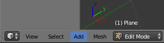
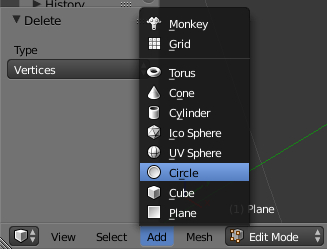
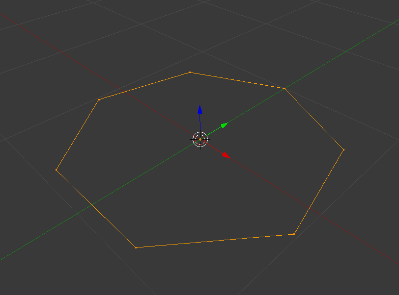

# Ein 7-Eck einfügen
Zuerst stellen wir sicher, dass wir uns im Edit Mode befinden.

 

Dann platzieren wir den 3D-Cursor auf der Stelle des gewünschten Mittelpunktes des 7-Ecks.

Durch einen Klick auf Add -> Circle können wir einen neuen Kreis einfügen. Dieser hat standardmäßig 32 Ecken.

Im von der linken Seite aufklappbaren Tool-Menü können wir im Nachhinein die Anzahl der Ecken von 32 auf 7 ändern.
Sollte das Tool-Menü noch nicht aufgeklappt sein, lässt sich das mit der Taste T nachholen.

Das fertige 7-Eck sollte sichtbar sein.

