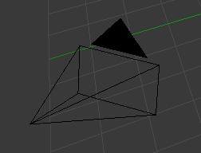

# Eine Einführung in Blender

## Objectmode und Editmode
Blender ist modusbasiert, das bedeutet, das Aktionen unterschiedliche Ergebnisse zeigen, je nachdem in welchem Modus sie ausgeführt werden. Für uns relevant sind nur der Objectmode und der Editmode. Der Modus kann in dem Menü unterhalb des 3D-Fensters gewechselt werden. Schnelle Wechseln geht mit TAB.

### Objectmode
Der Objectmode befasst sich ausschließlich mit Objekten und ihren Eigenschaften. In Blender sind alle Dinge in Objekte eingeteilt. Wenn wir Blender öffnen sehen wir drei verschiedene Objekte vor uns:

Eine Kamera

Eine Lampe

Einen Würfel

Alle drei Gegenstände sind Objekte mit gewissen Eigenschaften. Beispiele:

Die Kamera hat eine gewisse Brennweite und Auflösung.

Die Lampe hat eine gewisse Helligkeit und Lichtfarbe.

Der Würfel hat eine Geometrie (ein sogenanntes Mesh).

Alle Objekte haben zusätzlich eine eigene Position, Rotation und Skalierung im Raum.

### Editmode
Der Editmode befasst sich ausschließlich mit der Geometrieeigenschaft eines 3D-Objektes. In unserer Anfangssituation ist die einzige Geometrie das Mesh des Würfelobjektes. Die Unterscheidung zwischen Würfelobjekt und Würfelgeometrie ist wichtig, da es zum Beispiel auch mehrer Objekte geben kann, die sich ein Mesh teilen.

Der Editmode kann nur betreten werden, wenn man gerade ein Objekt ausgewählt hat, das den Modus unterstützt. In der Ausgangssituation ist das nur bei dem Würfelobjekt der Fall. Ist man einmal im Editmode in einem bestimmten Objekt, lassen sich andere Objekte nicht mehr anklicken oder verändern.

## Über Aktionen generell in Blender
Generell sind Aktionen in Blender relativ einheitlich gehalten. Einmal gelernte Muster lassen sich meistens auch auf andere Aktionen anwenden. 

Typisch ist zum Beispiel folgendes Muster: Sind wir an einer Stelle angekommen, an der wir uns zwischen Bestätigung oder Abbruch entscheiden müssen, lässt sich immer mit [LMB] oder [Enter] bestätigen, oder mit [RMB] und [Esc] abbrechen.

Ein anderes Muster: Einmal angewandte Aktionen lassen sich meistens im Nachhein verfeinern. Das hört sich unintuitiv an, macht aber durchaus Sinn, da man meistens mit den Standardeinstellungen einer Aktion zufrieden ist, manchmal aber genauere Einstellungen vornehmen möchte. Die Einstellungen zur Verfeinerung finden sich immer im Tools-Panel auf der linken Seite des 3D-Fensters.

## Dinge löschen
Dinge zu löschen funktioniert sowohl im Objectmode als auch im Editmode ähnlich: Man markiert die zu entfernende Sache und drückt [Entf] oder [X]. Die Entf-Taste ist intuitiver, die X-Taste ist dafür deutlich leichter zu erreichen. Man wird in jedem Fall noch einmal nach einer Bestätigung gefragt, die mit [LMB] oder mit [Enter] zu bestätigen ist. Im Editmode fragt Blender zusätzlich, was genau wir löschen wollen.

## Dinge Bewegen (G)
Sowohl im Objectmode als auch im Editmode kann man markierte Dinge bewegen. Die Ablauf dieser Aktion sieht, ausgehend davon, dass man die gewünschten Dinge markiert hat, wie folgt aus:

+ Taste [G] drücken. G steht für "Grab", englisch für greifen.
+ Die zu bewegende Sache folgt nun dem Mauszeiger. In der Fusszeile des 3D-Fensters sieht man, um welchen Betrag gerade verschoben wird.
+ Optional kann man nun mit den Tasten [X], [Y] oder [Z] eine Raumachse auswählen und die Bewegung damit auf diese Achse limitieren.
+ Optional kann man noch auf der Tastatur eine festen Betrag eintippen. Da Blender englischsprachig ist, muss man statt dem Komma den Punkt zur Trennung benutzen.
+ Abschliessend kann man die Operation mit [LMB] oder [Enter] bestätigen. Ein Abbruch mit [RMB] oder [Esc] kann zu jedem Zeitpunkt erfolgen.

## Dinge rotieren (R)
Das rotieren von Dingen erfolgt änlich wie das bewegen. Eingetippte feste Werte werden in Grad interpretiert (360 Grad für eine Umdrehung). Der einzige Unterschied zum Bewegen ist, dass hier die Taste [R] für Rotate verwendet wird.

## Dinge skalieren (S)
Das skalieren von Dingen funktionert áhnlich wie das bewegen. Eingetippte Werte werden als Faktor interpretiert. Wenn man also ein Objekt um den Wert zwei skaliert, sind danach alle Distanzen doppelt so groß geworden.

## Nochmal: Unterscheidung zwischen Objectmode und Editmode ist wichtig.
Es sei hier nochmal genauer dargelegt, was eigentlich der Unterschied zwischen Object- und Editmode ist. Alle bisher genannten Operationen (Löschen, Bewegen, Rotieren und Skalieren) sind in beiden Modi möglich, haben aber unterschiedliche Konsequenzen. Im Objectmode wird das gesamte Objekt verändert, im Editmode alleine die Geometrie. Beobachtbar ist das nur an dem verschobenen Objektmittelpunkt, der in Blender bei markierten Objekten als kleiner oranger Kreis dargestellt wird.

Da es häufig sinnvoll ist, den Objektmittelpunkt nur kontrolliert zu verschieben, empfiehlt es sich, alle Operationen nur im Editmode vorzunehmen.

Die Löschfunktion nimmt hier eine Sonderrolle ein, da das Löschen im Editmode nur die Geometrie löscht. Es bleibt also ein leeres Objekt zurück, das zwar an verschiedenen Orten in Blender noch in Erscheinung tritt, im 3D-Fenster allerdings nicht mehr sichtbar ist. Deswegen: Löschen nur im Objectmode.

## Endlich: Bearbeiten von Geometrie im Editmode
