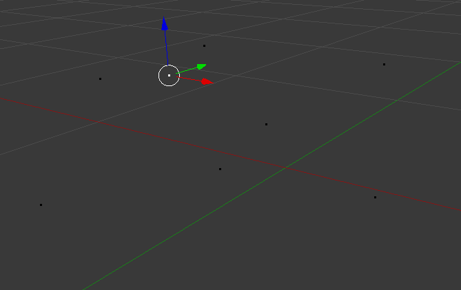

# Mehrere Vertices auf die gleiche Höhe bringen.

Wieder stellen wir sicher, dass wir uns im Edit-Mode befinden.

Wir haben eine Menge von Vertices vor uns. Diese haben wir zB erstellt, indem wir einen bereits vorhandenen Vertex mit Shift + D mehrmals lose im Raum herum kopiert haben. Diesesmal ist das lose PLatzieren nach Augenmaß erlaubt.

Aus der Menge wählen wir einen Vertex aus, auf dessen Höhe alle anderen Vertices gebracht werden sollen.

Auf diesen Vertex legen wir den 3D-Cursor.

Nun wählen wir als Pivotpunkt den 3D-Cursor fest. Der Pivotpunkt ist der Punkt, um den herum Operationen wie Rotate oder Scale ausgeführt werden. Standardmäßig ist der Pivotpunkt auf den Schwerpunkt der Auswahl, den sog. Median Point eingestellt. Die Einstellung des Pivotpunktes ändern wir im Menü unten von Median Point zu 3D-Cursor. 

Ziel der folgenden Aktion wird es sein, allen Vertices die gleiche Z-Koordinate zuzuweisen. Dies funktioniert, indem wir Skalieren, die Aktion auf die Z-Achse limitieren und dann 0 als Vergrößerungsfaktor wählen. Da wir den Pivotpunkt auf den 3D-Cursor gelegt haben werden alle Z-Koordinaten der Vertices auf die des 3D-Cursors geschrumpft. Die X- und Y-Koordinaten werden durch die Achsenbeschränkung nicht verändert.
Die Buchstabenfolge für die gewünschte Aktion ist im folgenden aufgelistet und, getrennt von einem "--", erläutert:

+ S -- Startet eine Skalieraktion
+ Z -- Beschränkt die Aktion auf die Z-Achse
+ 0 -- Schrumpft die Vertices auf die Größe Null, allerdings durch die davor angewählte Achsenbeschränkung nur in der Z-Achse
+ LMB -- Bestätigt die Aktion

Das Ergebnis ist eine Menge von Vertices, die alle die gleiche Z-Koordinate haben, also in einer Ebene liegen.

